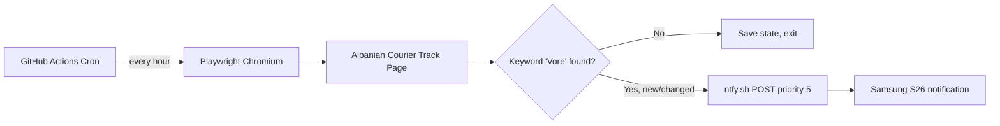

# CloudTracker

Automated, cloud-hosted package monitor for **Albanian Courier**. Checks your shipment tracking page **once per hour** for the keyword **"Vore"** and sends an **urgent push notification** to your phone when it appears.

Runs entirely in the cloud — no PC, no local scheduler, no credit card.

---

## Stack & Why Each Piece Was Chosen

| Layer | Choice | Why |
|-------|--------|-----|
| **Language** | Python 3.12 | Mature ecosystem, easy to maintain, first-class Playwright support |
| **Scraper** | Playwright (Chromium) | Albanian Courier sits behind JavaScript bot protection; plain HTTP requests get blocked. Playwright runs a real headless browser that passes the challenge and reads iframe content |
| **Scheduler** | GitHub Actions cron | 100% free on public repos (unlimited minutes), no credit card, no servers to manage, reliable `0 * * * *` hourly schedule in UTC |
| **Push notifications** | [ntfy.sh](https://ntfy.sh) | Free forever, no signup required, no credit card, supports priority 5 (urgent) with pop-over + vibration on Android. Works natively on Samsung phones via the ntfy app |
| **HTTP client** | httpx | Lightweight, modern, used only for the one-line ntfy POST |
| **State** | GitHub Actions cache | Prevents duplicate alerts every hour while the keyword stays visible; re-alerts if tracking text changes |

### Why not the alternatives?

| Alternative | Rejected because |
|-------------|------------------|
| APScheduler / cron on your PC | Requires your machine to stay on — violates your requirement |
| Pushover, Twilio, Firebase | Paid tiers, trials, or credit card required |
| Plain `requests` / BeautifulSoup | Blocked by Albanian Courier bot protection (415 / JS challenge page) |
| Cloudflare Workers Cron | Viable, but Playwright doesn't run in Workers; would still need an external browser |
| Render / Railway free cron | Free tiers sleep, expire, or require cards for always-on jobs |

---

## How It Works



1. GitHub Actions wakes up on the hour.
2. Playwright opens your tracking URL in headless Chromium.
3. The script waits for bot-protection to finish, collects all visible text (including iframes).
4. If **"Vore"** is found and this is a **new detection** (or the page text changed), it POSTs to ntfy with **Priority 5 (urgent)**.
5. State is cached so you don't get spammed every hour while the status stays the same.

---

## Setup (One-Time, ~10 Minutes)

### 1. Install ntfy on your Samsung S26

1. Install **[ntfy](https://play.google.com/store/apps/details?id=io.heckel.ntfy)** from Google Play.
2. Tap **+** → **Subscribe to topic**.
3. Enter a **secret topic name** only you know, e.g. `cloudtracker-xK9mP2vL8qR`.
4. Long-press the ntfy app → **Notifications** → open the **Max / Urgent (5)** channel → enable **Override Do Not Disturb**, pop-up, sound, and vibration.

### 2. Push this project to GitHub

```bash
git init
git add .
git commit -m "Add CloudTracker hourly Albanian Courier monitor"
git branch -M main
git remote add origin https://github.com/YOUR_USER/CloudTracker.git
git push -u origin main
```

> **Tip:** Use a **public** repository for unlimited free GitHub Actions minutes. Private repos include 2,000 min/month on the free plan.

### 3. Add GitHub Secrets

Go to **Settings → Secrets and variables → Actions → New repository secret**:

| Secret | Value |
|--------|-------|
| `TRACKING_NUMBER` | Your Albanian Courier POD / tracking number |
| `NTFY_TOPIC` | The secret topic you subscribed to in step 1 |

Optional secrets:

| Secret | When to use |
|--------|-------------|
| `TRACKING_URL` | Override the default tracking page URL |

Optional **variables** (Settings → Secrets and variables → Actions → Variables):

| Variable | Default |
|----------|---------|
| `KEYWORD` | `Vore` |
| `NTFY_SERVER` | `https://ntfy.sh` |

### 4. Test immediately

1. Go to **Actions** tab in GitHub.
2. Select **Hourly Package Tracker**.
3. Click **Run workflow** → **Run workflow**.
4. Watch the job log — you should see whether the keyword was found.
5. If found (or on first detection), your phone gets an urgent notification.

After that, the workflow runs automatically every hour.

---

## Tracking URL Notes

By default, the tracker opens the official Albania portal:

```
https://al.albaniancourier.al/track-trace/
```

The scraper waits for bot-protection to clear, then fills in your tracking number automatically.

If your shipment uses the Kosovo portal instead, set the `TRACKING_URL` secret to:

```
https://www.albaniancourier.al/ks/track-p.php?podNr=YOUR_NUMBER
```

---

## Local Testing (Optional)

```bash
python -m venv .venv
.venv\Scripts\activate        # Windows
pip install -r requirements.txt
python -m playwright install chromium

copy .env.example .env        # fill in your values
set TRACKING_NUMBER=...
set NTFY_TOPIC=...

python -m tracker.check
```

---

## Troubleshooting

| Problem | Fix |
|---------|-----|
| Workflow fails with timeout | Increase `PAGE_TIMEOUT_MS` variable to `120000` |
| No notification on phone | Confirm ntfy app is subscribed to the exact topic; check Max priority channel settings |
| Bot protection blocks scrape | Re-run workflow — GitHub's IP usually passes after the JS challenge; check Action logs for page text length |
| Wrong tracking page | Set `TRACKING_URL` secret to the exact URL you use in your browser |
| Duplicate notifications | State cache resets if you change `TRACKING_NUMBER`; this is expected on first run after a change |

---

## License

MIT — use freely.
